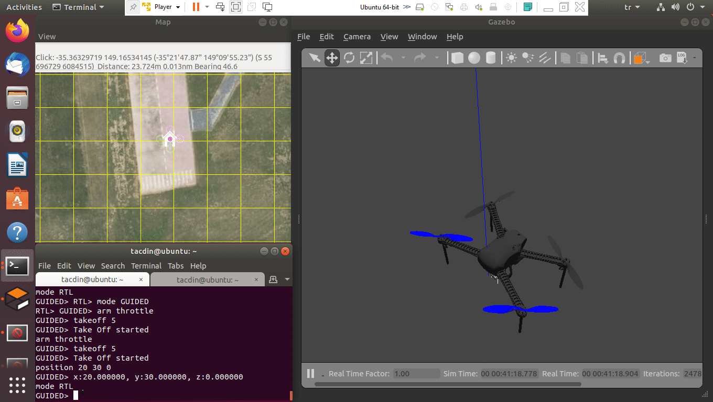
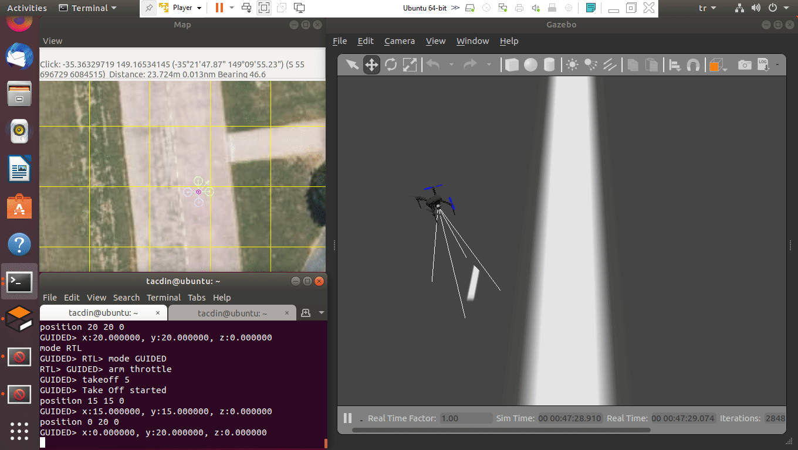

# UAV-Simulation-Tools

In this repo, there are simulation tools tests that I have done about unmanned aerial vehicles.

# Initialize Ardupilot SITL and Gazeboo

# SITL Basic Commands / MAVProxy

# What's going on in the Gazeboo?
### Arm and Takeoff

### Position

### DroneKit&Gazeboo -- Arm-Takeoff-Position

### DroneKit&Gazeboo -- Create a Mission

